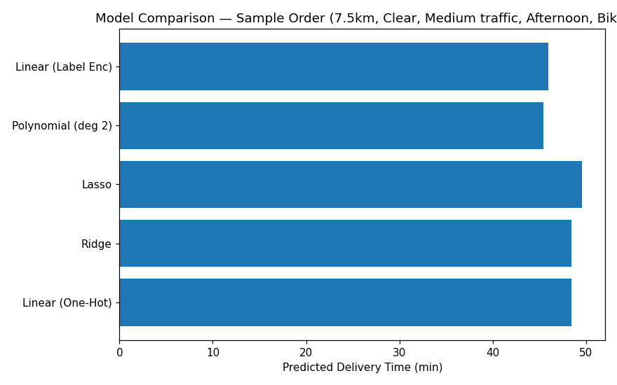

# 🛵 Food Delivery Time Prediction

An interactive **Streamlit web app** that predicts food delivery time using **five different regression models** trained on real delivery data — Linear Regression (two encoding strategies), Ridge, Lasso, and Polynomial Regression.



## ✨ Features

- Predict delivery time from order details: distance, weather, traffic level, time of day, vehicle type, preparation time, and courier experience
- Choose between **5 pre-trained regression models**, or use **"Compare All Models"** to see every model's prediction side-by-side on the same input
- Interactive sliders and dropdowns for all input features
- Dataset explorer with delivery-time distribution and distance-vs-time scatter plot
- All models were trained and evaluated in the included Jupyter notebook (`notebooks/Linear_Regression_SOL.ipynb`)

## 🤖 Models Included

| Model | File | Encoding Used |
|---|---|---|
| Linear Regression (One-Hot Encoded) | `models/linear_regression_dummies_model.pkl` | `pd.get_dummies` on categorical columns |
| Linear Regression (Label Encoded) | `models/linear_regression_encoded_model.pkl` | `LabelEncoder` on categorical columns |
| Ridge Regression | `models/ridge_regression_model.pkl` | One-hot encoded |
| Lasso Regression | `models/lasso_regression_model.pkl` | One-hot encoded |
| Polynomial Regression (degree 2) | `models/polynomial_regression_model.pkl` | One-hot encoded + `PolynomialFeatures(degree=2)` |

> The app rebuilds each model's expected input format at prediction time (one-hot vector, label-encoded vector, or polynomial-expanded vector) so every model receives features in exactly the shape it was trained on.

## 🛠️ Tech Stack

- **Python 3**
- **Streamlit** — web UI
- **scikit-learn** — Linear/Ridge/Lasso/Polynomial Regression, `PolynomialFeatures`
- **Pandas / NumPy** — data handling
- **Matplotlib** — visualization

## 📂 Project Structure

```
Food_Delivery_Time_Prediction/
├── app.py                                  # Streamlit app (UI + prediction logic)
├── Food_Delivery_Times.csv                 # Training dataset (1000 orders)
├── models/
│   ├── linear_regression_dummies_model.pkl
│   ├── linear_regression_encoded_model.pkl
│   ├── ridge_regression_model.pkl
│   ├── lasso_regression_model.pkl
│   └── polynomial_regression_model.pkl
├── notebooks/
│   └── Linear_Regression_SOL.ipynb         # Model training & evaluation notebook
├── screenshots/
│   └── model_comparison_sample.png
├── requirements.txt
├── .gitignore
└── README.md
```

## ⚙️ Setup Instructions

### 1. Clone the repository
```bash
git clone https://github.com/<your-username>/Food_Delivery_Time_Prediction.git
cd Food_Delivery_Time_Prediction
```

### 2. Create a virtual environment (recommended)
```bash
python -m venv venv
source venv/bin/activate      # On Windows: venv\Scripts\activate
```

### 3. Install dependencies
```bash
pip install -r requirements.txt
```

> **Note:** `scikit-learn==1.6.1` is pinned to match the version the models were trained/pickled with, avoiding version-mismatch warnings or errors when loading them.

### 4. Run the app
```bash
streamlit run app.py
```

The app will open in your browser at `http://localhost:8501`.

## 📊 Dataset

`Food_Delivery_Times.csv` contains 1000 food delivery orders with the following columns:

- `Order_ID` — unique order identifier
- `Distance_km` — delivery distance in kilometers
- `Weather` — Clear / Foggy / Rainy / Snowy / Windy
- `Traffic_Level` — Low / Medium / High
- `Time_of_Day` — Morning / Afternoon / Evening / Night
- `Vehicle_Type` — Bike / Scooter / Car
- `Preparation_Time_min` — time taken to prepare the order
- `Courier_Experience_yrs` — courier's years of experience
- `Delivery_Time_min` — **target** — actual delivery time

## 📌 Notes / Future Improvements

- Add model performance metrics (R², MAE, RMSE) directly in the app, computed live on a held-out test split.
- Add SHAP or coefficient-based feature importance visualizations to explain individual predictions.
- Deploy on Streamlit Community Cloud for a live shareable demo link.
- Retrain and version models with a consistent scikit-learn version to avoid pickle compatibility warnings long-term.

## 📄 License

This project is open source and available for personal/educational use.
